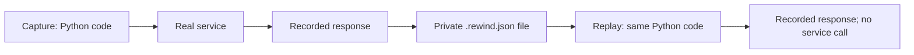

# Rewind: a practical guide for backend developers

[Documentation home](index.md)

You need basic Python, a terminal, and an understanding of HTTP requests. You do
not need to know Rewind or change your existing backend to complete the first demo.

## What problem does this solve?

Imagine an API fails because another service returns an unexpected response.
Later, that service returns something different, so you cannot reproduce the bug.
Rewind saves the selected observations from the original run. You run your Python
code again, and Rewind supplies those saved observations instead of calling the
service again.

A **recording**, also called a **snapshot** or **artifact**, is a `.rewind.json`
file. It contains the selected inputs, dependency observations, result or exception,
and compatibility information. It is not a copy of your backend, database or process.

**Capture** runs code with the real dependency and records selected observations.
**Replay** runs the supplied Python code using recorded observations.
**Reproduced** means the recorded behavior matched—even when that behavior is a 500
response or an exception. It does not mean the bug is fixed.



## 1. Get a working environment

Use Python 3.11 or 3.12. Start in a separate folder:

```sh
mkdir rewind-demo
cd rewind-demo
python3.12 -m venv .venv
source .venv/bin/activate
python -m pip install --pre 'jaysoft-rewind[httpx]'
rewind --version
```

On Windows, activate with `.venv\Scripts\activate`. `jaysoft-rewind` is the
installation name; `rewind` is the Python import and command. `--pre` allows the
current alpha release. You do not need an account, dashboard or cloud service.

## 2. Try a complete failure without running a backend

Create `demo.py` with this code:

```python
from rewind import CapturePolicy, LocalStore, ReplayTarget, Retention, Rewind


def make_target(live=False):
    recorder = Rewind(
        application="checkout-demo",
        code_paths=[__file__],
        store=LocalStore(".rewind/demo"),
        policy=CapturePolicy.synthetic(),
        retain=Retention(always=True),
    )

    def checkout():
        def call_provider():
            if not live:
                raise AssertionError("Replay must not call the provider")
            print("Provider called during capture")
            return {"status": "accepted"}  # Deliberately missing receipt_id.

        reply = recorder.value("provider.reply", call_provider)
        return reply["receipt_id"]

    return ReplayTarget(recorder, checkout, kind="callable_sync")


def replay_target():
    return make_target()


if __name__ == "__main__":
    target = make_target(live=True)
    try:
        target.rewind.run_sync(target.entrypoint)
    except KeyError:
        print("Captured the missing receipt_id failure")
    print("Recordings are in .rewind/demo/")
```

Run it:

```sh
python demo.py
rewind list --store .rewind/demo
```

You should see `Provider called during capture`, the failure message, and one
recording. `Retention(always=True)` keeps this demo's run even if its behavior
changes to a successful return. `CapturePolicy.synthetic()` permits fixture
values; only use it with data you are allowed to retain.

## 3. Inspect the file

Replace `SNAPSHOT_ID` below with the ID printed by `rewind list`:

```sh
rewind inspect .rewind/demo/SNAPSHOT_ID.rewind.json
```

The inspection describes whether the recording is complete, its entry-point
kind, and its interactions. Inspection validates data without running your app.
A complete recording is eligible for replay; an incomplete one explains what
was omitted or unsupported. Do not manually change its eligibility flag.

## 4. Replay the failure

Keep the same source file and virtual environment. Run:

```sh
rewind replay .rewind/demo/SNAPSHOT_ID.rewind.json --app demo:replay_target
```

Expected result: `status` is `reproduced`, with `consumed` equal to `total`.

`demo:replay_target` means: import `demo.py` from this directory and call its
`replay_target()` function. That function tells Rewind which Python code to run.
The artifact itself never chooses an arbitrary module to import.

The provider's print message must **not** appear during replay. The replay factory
also raises if the provider is called, so a successful replay proves that the
recorded reply was used. The CLI uses a fresh Python process and installs its
Python network guard before importing the selected factory.

## 5. Try an existing local backend

This first integration records the **HTTP status and JSON response** from your
backend. It requires no changes inside the server. It does not capture the
server's functions, SQL queries or internal requests.

Download the ready-to-run example into your demo directory:

```sh
curl -fsSL \
  https://raw.githubusercontent.com/iamjpsonkar/JaySoft-Rewind/main/examples/existing_backend.py \
  -o backend_replay.py
```

Start your usual local backend. Replace the URL with one of its test endpoints
that returns JSON:

```sh
python backend_replay.py --url 'http://localhost:8001/example?amount=100'
```

The command prints the HTTP status, the artifact path, and `complete`. A 4xx or
5xx response is still recorded if it contains JSON. Connection failures or
non-JSON responses raise an error; inspect your local application configuration.

For headers, create a private file named `headers.local.json`:

```json
{
  "Accept": "application/json",
  "X-Application-ID": "local-test-application"
}
```

Then run:

```sh
chmod 600 headers.local.json
python backend_replay.py \
  --url 'http://localhost:8001/example?amount=100' \
  --headers-file headers.local.json
```

Use whatever headers your own local endpoint requires. Keep credential files and
artifacts out of Git. This example captures the selected returned response value;
request headers are used only by the live provider and are not passed to Rewind.
If the response itself contains sensitive information, it still needs a suitable
capture policy. Key-based filtering is not complete personal-data detection.

Copy the printed artifact path into:

```sh
rewind inspect .rewind/backend-demo/SNAPSHOT_ID.rewind.json
rewind replay .rewind/backend-demo/SNAPSHOT_ID.rewind.json \
  --app backend_replay:replay_target
```

You can stop your backend before replay. The replay factory has no live client or
headers-file dependency and raises if the live response provider is invoked.
A successful result proves response-value reproduction without another request.

## 6. Understand what you have—and what to instrument next

| Your goal | Boundary to record |
| --- | --- |
| Reuse the response returned by an existing local server | The response-value example above |
| Reproduce a bug in your handler when an upstream API responds | Your handler plus an explicit HTTPX transport |
| Include SQL results used by that handler | A supported database adapter wired to that application's connections |
| Include cache reads | The documented Redis wrapper |
| Reproduce time, UUID or random values | Explicit `Sources` calls where the application observes them |

For debugging **inside** your backend, install and configure Rewind in that
backend process. Capture the handler and wrap the dependencies it actually uses.
A client-side recording cannot reveal unrecorded server SQL or local variables.
Start with one handler and one failing dependency rather than expecting package
installation to instrument every library automatically.

Use [HTTP and FastAPI integration](http-and-fastapi.md),
[synchronous applications](synchronous.md), [database setup](database.md), and
[the support matrix](support-matrix.md) to choose the matching adapter. Check the
actual library versions and concurrency model before wiring an integration.

## 7. Turn the recording into a test

For the small `demo.py` example:

```sh
python -m pip install pytest
rewind test .rewind/demo/SNAPSHOT_ID.rewind.json \
  --app demo:replay_target --output test_reproduction.py
python -m pytest test_reproduction.py -q
```

This is a **reproduction test**: it verifies that the original behavior can be
replayed. To verify a fix, specify the desired behavior yourself and use
[changed-code comparison](comparison.md). Rewind cannot infer the correct
business outcome from a recording of a bug.

## 8. Interpret the result

| Result | Meaning | Next step |
| --- | --- | --- |
| `reproduced` | Observations and outcome matched | Use the reproduction to investigate or test a fix |
| `diverged` | A call, argument, ordering or result differed | Inspect the first reported difference |
| `ineligible` | Required data was omitted, transformed or unsupported | Read the capture reasons; adjust the supported boundary or policy |
| `incompatible` | Source/runtime/policy no longer matches | Restore the capture environment or explicitly compare changed source |
| `replay_error` | Factory, artifact or execution could not be loaded safely | Check `--app`, current directory, installed dependencies and timeout |

Common capture reasons:

- `sensitive_header_removed`: credentials were redacted. Strict HTTP-transport
  replay does not pretend that transformed request is identical. The separate
  response-value example avoids recording request authentication entirely.
- `compressed_response_unsupported`: the HTTP transport saw an unsupported
  compressed response. For a controlled test, request `Accept-Encoding: identity`.
- `child_task_unsupported`: a dependency ran outside the owning task/thread.
- Size or interaction limits: the recording exceeded its configured budget.

Never edit a snapshot to force success. An honest ineligible/diverged result is
more useful than a reproduction that silently makes a new live call.

## A simple daily workflow

1. Pick a local, reproducible request and permitted fixture data.
2. Configure one supported recording boundary and run the request once.
3. Inspect the retained artifact and its eligibility reasons.
4. Replay with the same source and dependency versions.
5. Add a reproduction test; investigate the code using the recorded inputs.
6. Define the expected fixed result and compare the change.
7. Delete recordings when you no longer need them.

To delete a recording from the first demo:

```sh
rewind delete SNAPSHOT_ID --store .rewind/demo
```

Recordings remain local unless you explicitly copy or export them. Store paths,
retention and optional background persistence are configurable; see
[operations](operations.md). Start with the synchronous demo before adding those
controls to a running application.
